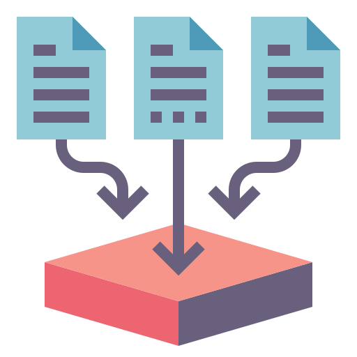

<h1 align="center">
  
   
  Modern Data Stack
</h1>

<strong>A modern data stack with Kubernetes</strong>

    
    
    

# About

This personal open-source portfolio project is a modern data stack designed to showcase my skills in **data engineering and software development**.

By integrating the **latest data tools and technologies**, I aim to demonstrate my proficiency in collecting, storing, processing, and visualizing large volumes of data, and provide valuable insights to users.

My goal is **to create a robust and efficient data platform that can be customized for various use cases**, and contribute to the open-source community by sharing my knowledge and expertise.

More about the [architecture](docs/ARCHITECTURE.md).

# Installation

TODO Write the installation guide

# Usage

TODO Write the usage guide

# Contributing

Check the [CONTRIBUTING.md](./CONTRIBUTING.md)

# Help

...

