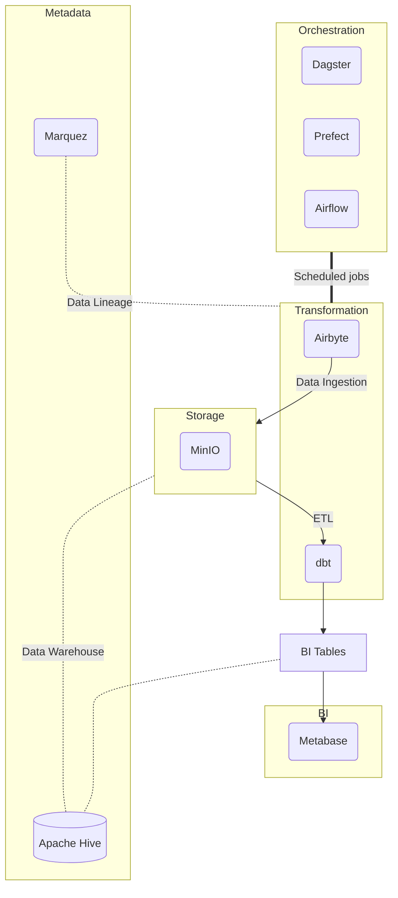

# Architecture

```mermaid
flowchart TD
	minio(MinIO)
	marquez(Marquez)
  airbyte(Airbyte)
	dbt(dbt)
	metabase(Metabase)
	dagster(Dagster)
	prefect(Prefect)
	airflow(Airflow)
	hive[(Apache Hive)]

	subgraph Storage
	minio
	end

	subgraph BI
	metabase
	end

	subgraph Transformation
	airbyte
	dbt
	end

	subgraph Orchestration
	dagster
	airflow
	prefect
	end

	subgraph Metadata
	marquez
	hive
	end

	%% Implicit links
	Storage -. Data Warehouse  .- hive
	marquez -. Data Lineage .- Transformation
	Orchestration == Scheduled jobs === Transformation

	%% Explicit links
	airbyte -- Data Ingestion --> Storage
	Storage -- ETL --> dbt
	bitables[BI Tables]
	bitables -..- hive
	dbt --> bitables --> metabase
```

# Tools

TODO Describe the tools

